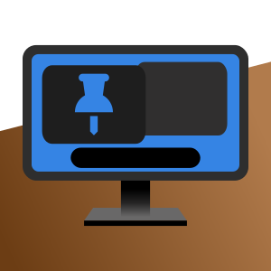

        

# OnTheTop
OnTheTop is a GNOME extension that aims to allow applications that don't have the 'Always On Top' feature in their default menus to stay on top of the other windows

## Solution 1
To add the extension to the GNOME Shell, you can do so at this link: [GNOME extension](https://extensions.gnome.org/extension/6571/on-the-top/)

## Solution 2

If the link is not available you can add it to the Shell:
1. Download the file from this link:

        https://github.com/fablevi/OnTheTop-fablevi.github.io/archive/refs/heads/main.zip

2. Once downloaded unzip it.

3. Rename the name of the unzipped folder to: 
    
        OnTheTop@fablevi.github.io

4. Copy the unzipped, renamed folder here, with this code: 

        cp -r  Downloads/OnTheTop@fablevi.github.io .local/share/gnome-shell/extensions/

5. Restart the OS: 

        systemctl reboot

> **Warning**
> Tested with Ubuntu 23.10 x86_64 

Works with GNOME: 45!

Note: Tested with [DING](https://gitlab.com/rastersoft/desktop-icons-ng) extension, and it got some bugs. Try with vanilla GNOME, it will work fine :)

Testing on GNOME 46!
